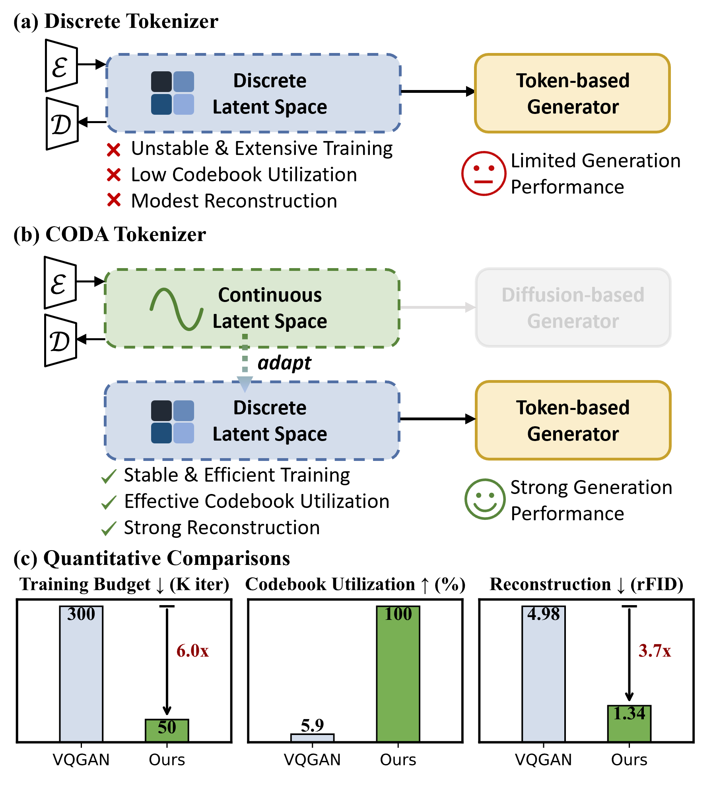

# CODA: Repurposing Continuous VAEs for Discrete Tokenization

<a href='https://arxiv.org/abs/2503.17760'>
<a href='https://lzy-tony.github.io/coda'>

This is the official implementation of CODA, introduced in [CODA: Repurposing Continuous VAEs for Discrete Tokenization](https://arxiv.org/abs/2503.17760).

## :high_brightness: Highlights

We identify that training conventional VQ tokenizers is inherently challenging, as it requires both **compressing** visual signals into a compact representation and **discretizing** them into a fixed set of codes. This often lead to unstable training, low codebook utilization, and limited reconstruction quality. Instead of training discrete tokenizers from scratch, we introduce **CODA** (**CO**ntinuous-to-**D**iscrete **A**daptation), which adapts off-the-shelf continuous VAEs --- already optimized for perceptual compression --- into discrete tokenizers via a carefully designed discretization process. This ensures stable and efficient training while retaining the strong visual fidelity of continuous VAEs.

<div align=center>

</div>

## :wrench: Usage

### Tokenizer

Install corresponding environments with

```
git clone git@github.com:LeapLabTHU/CODA.git
cd tokenizer
pip install -r requirements.txt
```

Prepare the required pretrained models and dataset

1. Prepare the ImageNet dataset and replace the `PATH_TO_IMAGENET` with the corresponding path on your machine.
2. Prepare the pretrained models: [MAR VAE](https://huggingface.co/jadechoghari/mar/blob/main/kl16.safetensors), [FLUX VAE](https://huggingface.co/black-forest-labs/FLUX.1-dev/tree/main/vae) and [Style-GAN DINO discriminator](https://dl.fbaipublicfiles.com/dino/dino_deitsmall16_pretrain/dino_deitsmall16_pretrain.pth):

```
data
├── train
│   ├── folder 1 (class 1)
│   ├── folder 2 (class 1)
│   ├── ...
|
├── val
│   ├── folder 1 (class 1)
│   ├── folder 2 (class 1)
│   ├── ...


checkpoints
├── mar_vae
│   ├── kl16.safetensors
|
├── flux_vae
│   ├── config.json
│   ├── diffusion_pytorch_model.safetensors
|
├── dino_disc
│   ├── dino_deitsmall16_pretrain.safetensors

```

Training

```
bash run.sh
```

See `run.sh` for detailed configs for running MAR and FLUX based models.


## :books: Model Zoo

| Model           | Link                                                         |
| --------------- | ------------------------------------------------------------ |
| MAR, $V=16384$  | [link](https://huggingface.co/shuidi0020/CODA/tree/main/mar_v16384) |
| FLUX, $V=65536$ | [link](https://huggingface.co/shuidi0020/CODA/tree/main/flux_v65536) |


## :mag_right: Code Release 

  - [ ] Generation training code & checkpoints
  - [x] Tokenizer checkpoints
  - [x] Tokenizer training codes


## :mailbox_with_mail: Contact

⛽⛽⛽ [liuzeyu24@mails.tsinghua.edu.cn](liuzeyu24@mails.tsinghua.edu.cn)

## :bookmark: Acknowledgements

Our implementation is based on [vaex](https://github.com/FoundationVision/vaex), [VQGAN](https://github.com/CompVis/taming-transformers), [SEED-Voken](https://github.com/TencentARC/SEED-Voken), [MAR](https://github.com/LTH14/mar), [pytorch-fid](https://github.com/mseitzer/pytorch-fid).

We thank the authors for their excellent work.

